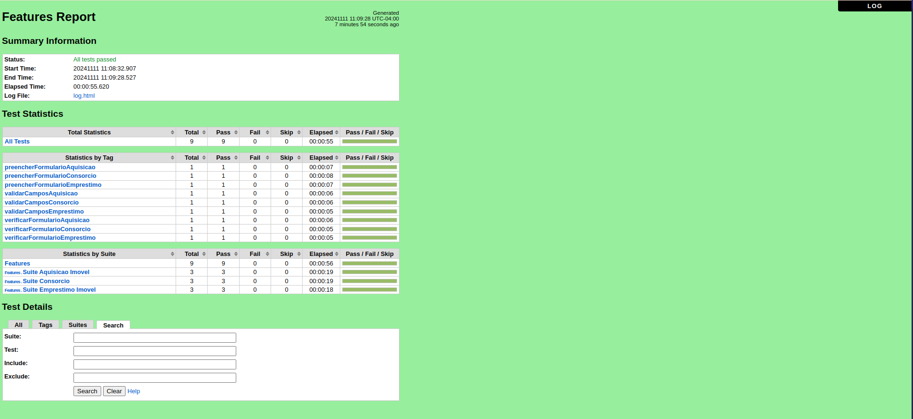
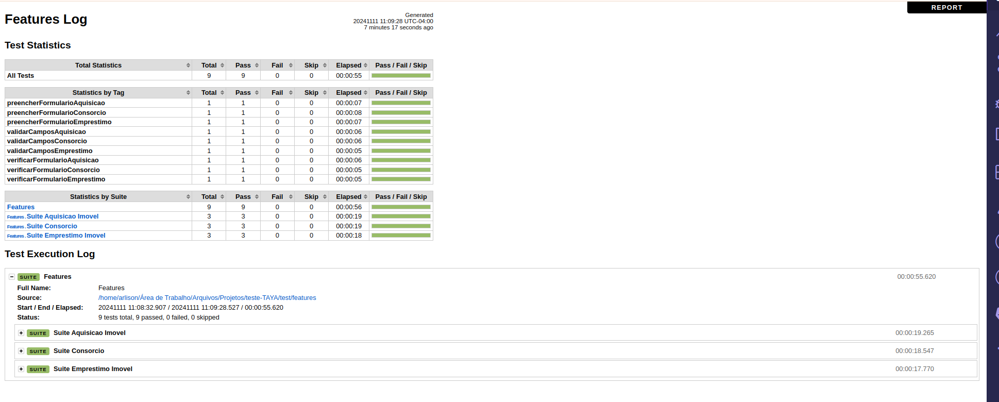

# Teste TAYA

## Estrutura do Projeto

- auto/: Diretório principal do projeto.

- keywords/: Contém palavras-chave customizadas usadas para a reutilização de códigos nos casos de teste.

- pages/: Contém as páginas do sistema mapeadas com os elementos e funções relacionadas.

- config/: Contém configurações gerais e hooks utilizados nos testes.

- test/: Diretório que contém os casos de teste automatizados.

- features/: Contém os arquivos de testes automatizados.

- logs/: Diretório onde são armazenados os relatórios e logs dos testes executados.

## Requisitos

Para rodar os testes, é necessário ter instalado:

- Python 3.x
- Robot Framework
- SeleniumLibrary 
- WebDriver (ChromeDriver, GeckoDriver, etc., dependendo do navegador utilizado)

**No caso para padronizar foi utilizado o chrome. A seguir está os passos para configurar o ambiente.**

## Instalação

Clone este repositório:

```git clone https://github.com/arlisonmarreiro/https://github.com/arlisonmarreiro/Teste-TAYA.git```

#### **Instalar as dependências necessárias:**

```bash
    pip install -r requirements.txt
```

#### **Instalar o ChromeDriver**

1. **Ubuntu/Linux**

**Certifique-se de que o ChromeDriver está instalado e no caminho do sistema**

Caso não esteja instalado, basta executar o script abaixo:

```bash
    chmod +x ./update_chromedriver.sh
    ./update_chromedriver.sh
```
2. **Windows**

Baixar o webdrivers no link abaixo:

 * [Chrome](https://developer.chrome.com/docs/chromedriver/downloads?hl=pt-br)

Copie e cole os webdrivers para o diretorio 
```C:\Users\SeuUsuario\AppData\Local\Programs\Python\Python310\Scripts ```

**Com o python ja instalado na sua máquina e ele ja está no path, facilita colocar o webdriver nessa pasta**

### Executando os Testes

1. **Executar Todos os Testes**

**Para executar todos os casos de teste, Certifique-se que esteja dentro da raiz**

**Instruções para executar os scripts:**

Para executar a suite de teste de Aquisição de imóvel basta executar os comandos.


1. Esse comando vai executar todos as suítes de teste, seja Aquisição de imóvel, Empréstimo e Consórcio.
```bash
robot -d ./test/logs ./test/features
```
2. Esse comando abaixo vai executar todos os casos de teste da Suite de **Aquisição de imóvel**
```bash
robot -d ./test/logs ./test/features/suite_aquisicao_imovel.robot
```
3. Escolha um desses comandos para executar casos de teste específicos de Aquisição de imóvel

    ***Observação, cada tag depois de -i é um caso de teste, exemplo: -i verificarFormularioAquisicao é o caso de teste para verificar se o formulário aparece. Seguindo essa mesma lógica escolha um caso de teste em específico para executar, senão execute o comando ```robot -d ./test/logs ./test/features/suite_aquisicao_imovel.robot``` que irá executar todos os casos de teste da Suite de Aquisição de imóvel, ou ```robot -d ./test/logs ./test/features``` para executar todas as suítes não apenas Aquisição de imóvel.***
```bash
robot -d ./test/logs -i verificarFormularioAquisicao ./test/features/suite_aquisicao_imovel.robot
robot -d ./test/logs -i preencherFormularioAquisicao ./test/features/suite_aquisicao_imovel.robot
robot -d ./test/logs -i validarCamposAquisicao ./test/features/suite_aquisicao_imovel.robot
```
4. Esse comando abaixo vai executar todos os casos de teste da Suite de **Empréstimo com Garantia Imóvel**
```bash
robot -d ./test/logs ./test/features/suite_emprestimo_imovel.robot 
```
5. Escolha um desses comandos para executar casos de teste específicos de Empréstimo com Garantia Imóvel
```bash
robot -d ./test/logs -i verificarFormularioEmprestimo ./test/features/suite_emprestimo_imovel.robot 
robot -d ./test/logs -i preencherFormularioEmprestimo ./test/features/suite_emprestimo_imovel.robot 
robot -d ./test/logs -i validarCamposEmprestimo ./test/features/suite_emprestimo_imovel.robot 
```
6. Esse comando abaixo vai executar todos os casos de teste da Suite de **Consórcio**
```bash
robot -d ./test/logs ./test/features/suite_consorcio.robot 
```
7. Escolha um desses comandos para executar casos de teste específicos de Consórcio
```bash
robot -d ./test/logs -i verificarFormularioConsorcio ./test/features/suite_consorcio.robot 
robot -d ./test/logs -i preencherFormularioConsorcio ./test/features/suite_consorcio.robot 
robot -d ./test/logs -i validarCamposConsorcio ./test/features/suite_consorcio.robot 
```
* **-d** significa que vai ser criado um diretório chamado **logs** dentro de **test** para armazenar os logs

* **É possivel adicionar a flag -i seguido da tag do caso de teste para executar apenas um teste em específico**

* **Ou adicionar a tag -e seguido da tag do caso de teste para excluir ele da execução**

**Exemplos:**

Aqui vai ser executado somente o caso de teste que possui a tag **verificarFormularioAquisicao**
```bash
robot -d ./test/logs -i verificarFormularioAquisicao ./test/features/suite_aquisicao_imovel.robot
```
Aqui vai ser executado todos os testes menos o da tag **verificarFormularioAquisicao**

```bash
robot -d ./test/logs -e verificarFormularioAquisicao ./test/features/suite_aquisicao_imovel.robot
```


### Relatórios e Logs

Após a execução dos testes, os relatórios podem ser encontrados no diretório logs/. Você terá acesso aos seguintes arquivos:

- report.html: Relatório detalhado da execução dos testes.

- log.html: Logs detalhados dos passos executados.


- output.xml: Arquivo de saída que pode ser utilizado para integrações.

### Personalização dos Testes

- Variáveis: É possivel definir variáveis globais nos arquivos de configuração, localizados no diretório config/, para facilitar a parametrização dos testes.

- Palavras-chave: Para reaproveitar código e manter os testes organizados, keywords customizadas podem ser criadas e armazenadas no diretório keywords/.